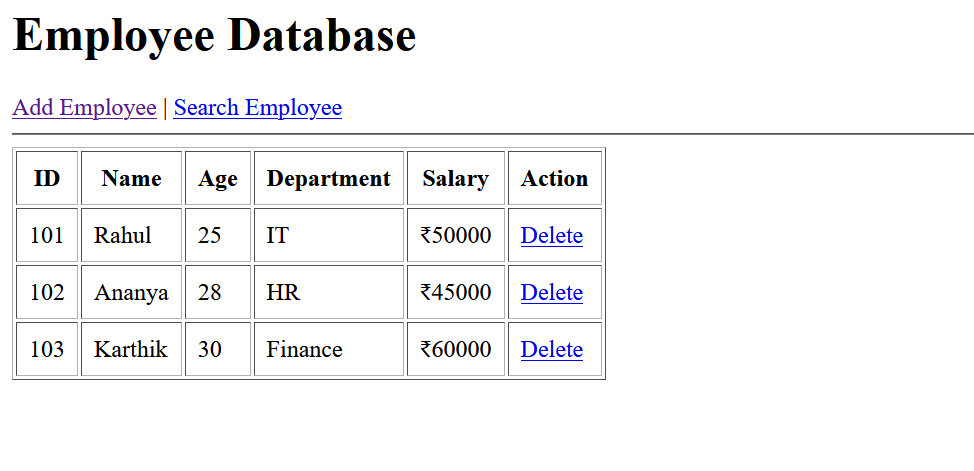
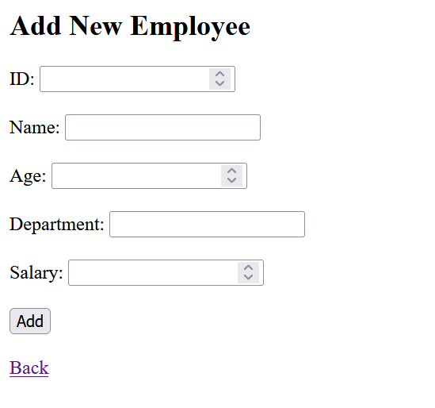
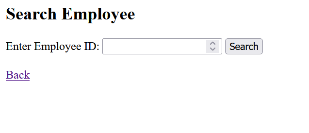

# 🧑‍💼 Employee Database Management System (Flask)

A simple **Employee Database Management System** built using **Flask (Python)** that allows users to perform basic **CRUD operations** such as adding, viewing, searching, and deleting employee records through a web interface.

This project is ideal for **beginners learning Flask**, **college mini-projects**, and as a **foundation for database-backed web applications**.

---

## 🚀 Features

* 📋 View all employee records
* ➕ Add new employee details
* 🔍 Search employee by ID
* ❌ Delete employee records
* 🌐 Web-based UI using HTML templates
* 🧠 In-memory data storage (can be upgraded to a database)

---

## 🛠️ Tech Stack

* **Backend:** Python, Flask
* **Frontend:** HTML (Jinja2 Templates)
* **Web Framework:** Flask
* **Database:** In-memory (List of Dictionaries)
* **Version Control:** Git & GitHub

---

## ⚙️ Installation & Setup

1. **Clone the repository**

```bash
git clone https://github.com/pranjal25r/Employee-database.git
cd Employee-database
```

2. **Run the application**

```bash
python app.py
```

3. **Open your browser**

```
http://127.0.0.1:5000/
```

---

## 🎯 Use Cases

* Learning **Flask basics**
* College **mini-project / lab submission**
* Understanding **CRUD operations**
* Foundation for **database-driven web apps**

---

## 🔮 Future Enhancements

* ✅ Integrate **SQLite/MySQL** using SQLAlchemy
* 🔐 Add **User Authentication**
* 🌍 Create **REST APIs**
* 🎨 Improve UI using **Bootstrap**
* 🐳 Dockerize the application
* 📁 Persist data using **files or cloud storage**

---

## 📸 Screenshots (Optional)

<p align="center">
  
</p>

<p align="center">
  
</p>

<p align="center">
  
</p>

---

## 🤝 Contributing

Contributions are welcome!
Feel free to fork this repository, create a new branch, and submit a pull request.